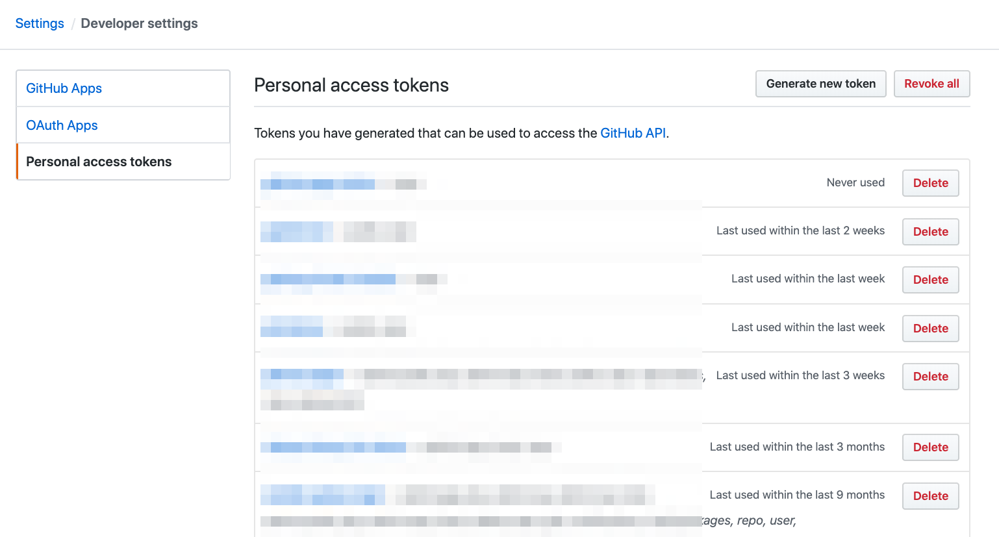

# 🚀 GitHub Pages for GitHub Actions

[GitHub Action](https://github.com/features/actions) for deploying a static site on GitHub Pages.


## Usage

Deploying a static site on GitHub Pages.

```yaml
name: Deploy the static file to GitHub Page
on: [push]
jobs:

  build:
    name: Build
    runs-on: ubuntu-latest
    steps:
    - name: checkout
      uses: actions/checkout@v1

    - name: deploy docs
      uses: ./
      with:
        username: ${{ secrets.USERNAME }}
        password: ${{ secrets.PASSWORD }}
        remote_url: https://github.com/appleboy/gh-pages-action.git
        commit_author: Bo-Yi Wu
        commit_author_email: appleboy.tw@gmail.com
```

Please create your own personal token on GitHub setting page.



output:

```sh
 D Dockerfile
 D LICENSE
 D README.md
 D action.yml
 D docs/index.html
 D entrypoint.sh
?? index.html
+ git add .
+ git commit -m commit 6b0497a3b6f0f975c605c28950dbe15dedf4e8f0
Author: Bo-Yi Wu <***.tw@gmail.com>
Date:   Sat Mar 7 20:25:50 2020 +0800

    chore: update

[gh-pages f156e8c] commit 6b0497a3b6f0f975c605c28950dbe15dedf4e8f0 Author: Bo-Yi Wu <***.tw@gmail.com> Date:   Sat Mar 7 20:25:50 2020 +0800
 7 files changed, 94 deletions(-)
 delete mode 100644 .github/workflows/ci.yml
 delete mode 100644 Dockerfile
 delete mode 100644 LICENSE
 delete mode 100644 README.md
 delete mode 100644 action.yml
 delete mode 100755 entrypoint.sh
 rename docs/index.html => index.html (100%)
+ git push origin HEAD:gh-pages
To https://github.com/***/gh-pages-action.git
   bd265c2..f156e8c  HEAD -> gh-pages
```

## Input variables

See [action.yml](./action.yml) for more detailed information.

* username - github username
* password - github password or your personal access token
* upstream_name - git upstream to target, default is `origin`
* target_branch - git branch to target, default is `gh-pages`
* temporary_base - temporary directory for pages pull, default is `.tmp`
* pages_directory - directory of content to publish, default is `docs`
* target_directory - directory of content to sync
* exclude - exclude files matching PATTERN
* commit_author - git author name
* commit_author_email - git author email
* remote_url - git remote url
* workspace - git clone path

### Example

Deploy to target directory.

```yaml
- name: deploy to target directory
  uses: ./
  with:
    username: ${{ secrets.USERNAME }}
    password: ${{ secrets.PASSWORD }}
    remote_url: https://github.com/appleboy/gh-pages-action.git
    commit_author: Bo-Yi Wu
    commit_author_email: appleboy.tw@gmail.com
    target_directory: 2020
```

Custom ignore list you don't want to sync.

```yaml
- name: exclude list
  uses: ./
  with:
    username: ${{ secrets.USERNAME }}
    password: ${{ secrets.PASSWORD }}
    remote_url: https://github.com/appleboy/gh-pages-action.git
    commit_author: Bo-Yi Wu
    commit_author_email: appleboy.tw@gmail.com
    target_directory: ignore
    exclude: ignore.html
```
